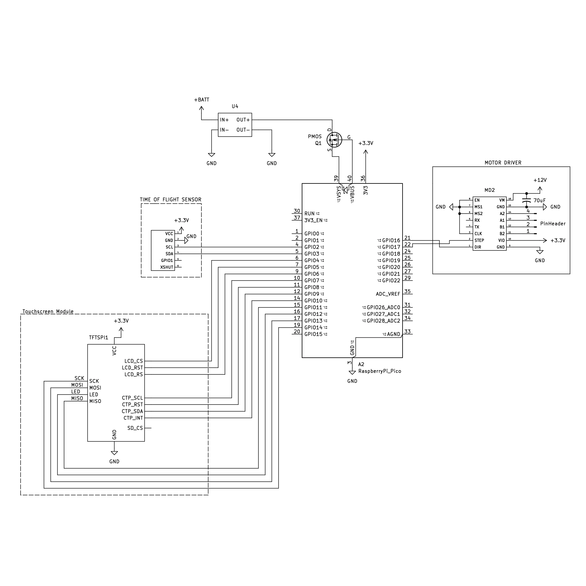

# ball and beam robot

everything needed to power a ball and beam balance robot (bbb) using a stepper motor, including the code, parts lists, CAD model, and instructions. when you're done, check out our [inverted pendulum robot](https://github.com/jtof-dev/robotics-traveling-van-ipr) and our [website](https://sce.nau.edu/capstone/projects/EE/2026/RoboVan/)

```ascii flowchart
                              ┌─────────┐
                              │         │
                              │ initial │
                              │  boot   │
                              │         │
                              └────┬────┘
                                   │
            ┌───────────────┐      │      ┌─────────────┐
            │               │      │      │             │
            │ reset beam to │◄─────┼─────►│ set up pins │
            │    center     │      │      │ and sensor  │
            │               │      │      │             │
            └───────────────┘      │      └─────────────┘
                                   ▼
                              ┌────────┐
                              │        │
                              │ main() │
                              │        │
                              └────┬───┘
                                   │
                                   │
                                   │
                                   ▼
  ┌────────────────┐      ┌──────────────────┐      ┌───────────────┐
  │                │      │                  │      │               │
  │  send desired  ├─────►│ write a frame to ├─────►│ read time of  │
  │ angle to motor │      │ the touchscreen  │      │ flight sensor │
  │                │      │                  │      │               │
  └────────────────┘      └──────────────────┘      └────────────┬──┘
     ▲                                                           │
     │                                                           │
     │                                                           │
     │                                                           │
     │                                                           │
     │    ┌─────────────────────┐      ┌─────────────────────┐   │
     │    │                     │      │                     │   │
     └────┤ adjust output value │◄─────┤ run PID calculation │◄──┘
          │                     │      │                     │
          └─────────────────────┘      └─────────────────────┘
```

# notes

## directory structure

- **datasheets/**: datasheets for the specific parts used in this robot
- **lib/**: contains all submodules
- **scripts/**: all scripts commonly used while writing code
- **sims/**: any python scripts used to model the behavior of the inverted pendulum
- **src/**: our own written code, split into a `configuration.hpp` and `main.cpp`, along with some extra functions split off into individual files

# software

because there are no good screen libraries written for the pi pico, we are instead using one written for arduino, and then compiling a mixture of arduino and pico code

## building

- first, fetch all submodules with `git submodule update --init --recursive` or delete and re-clone all submodules with `scripts/submoduleSetup.sh`

- second, install two `arduino-cli` (and `arduino-cli` if needed) dependencies that get used in `CMakeLists.txt`:

```bash
arduino-cli core update-index --additional-urls https://github.com/earlephilhower/arduino-pico/releases/download/global/package_rp2040_index.json
arduino-cli core install rp2040:rp2040 --additional-urls https://github.com/earlephilhower/arduino-pico/releases/download/global/package_rp2040_index.json
```

then build with CMAKE (or with `scripts/buildFresh.sh`):

```bash
    mdkir build
    cd build
    cmake ..
    make
```

(note: updating configurations in `src/configuration.hpp` does not trigger a proper re-build, so only running `make` will often not be enough. instead re-run all of the commands or use `scripts/buildFresh.sh`)

## uploading

- to flash the compiled `.uf2`, either reboot the pico into BOOTSEL mode (hold the BOOTSEL button and plug in the pico), or use `picotool` (or `scripts/upload.sh`):

```bash
picotool load -f -x flash.uf2
```

## submodules

- [bodmer/TFT_eSPI](https://github.com/Bodmer/TFT_espi)
- [raspberrypi/pico-sdk](https://github.com/raspberrypi/pico-sdk)
- [yspreen/VL53L0X-driver-pico-sdk-cpp](https://github.com/yspreen/VL53L0X-driver-pico-sdk-cpp)

## sims

- located in `sims/`, and models the expected behavior of the robot. theoretically, it should produce similar gain values to what will be used on the physical robot
- the python environment is managed with `uv`:

```bash
uv sync
uv run main.py
```

or, install `matplotlib` and run normally

# hardware



## parts list

- [NEMA 17](https://a.co/d/05dRpuKu) stepper motor
- raspberry pi pico or [RP2040](./datasheets/RP2040_datasheet.pdf) compatible board
- [TMC2209](./datasheets/TMC2209_datasheet.pdf) stepper motor driver
- touchscreen with [ST7796S](./datasheets/ST7796S_datasheet.pdf) display driver
- [VL53L0X](./datasheets/VL53L0X_datasheet.pdf) time of flight sensor

### generic parts

- 4-pack of 3.3V batteries (in series for 13V total), matching BMS, and charger
  - be sure to match max voltage, current, and battery chemistry type between all three components
- step-down voltage converter to 3.3V
- 470uF 25V electrolytic capacitor

## pin configuration

### RP2040

| **pin** | **connection**         |
| :------ | :--------------------- |
| VIN     | schottky diode cathode |
| GND     | buck converter GND     |
| 3V3     | to rail on protoboard  |
| pin 6   | I2C1 SDA on VL53l0X    |
| pin 7   | I2C1 SCL on VL53l0X    |
| pin 16  | STEP on TMC2209        |
| pin 17  | DIR on TMC2209         |

### ST7796S touchscreen

| display pin | pi pico pin | notes / function | wire color |
| :--- | :--- | :--- | :--- |
| VCC | external 3.3V | power for the display | red |
| GND | common GND | ground | black |
| LCD_CS | GP20 | TFT chip select (`TFT_CS`) | orange |
| LCD_RST | GP21 | TFT reset (`TFT_RST`) | yellow |
| LCD_RS | GP22 | TFT data/command (`TFT_DC`) | green |
| SDI (MOSI) | GP19 | SPI data input (`TFT_MOSI`) | blue |
| SCK | GP18 | SPI clock (`TFT_SCLK`) | purple |
| LED | 3.3V | backlight power. connect to 3.3V external power, it will overdraw the pico if connected to a data pin | white |
| SDO (MISO) | GP16 | SPI data output (`TFT_MISO`) | gray |
| CTP_SCL | GP3 | I2C1 clock (capacitive touch) | orange |
| CTP_RST | GP6 | touch reset | yellow |
| CTP_SDA | GP2 | I2C1 data (capacitive touch) | green |
| CTP_INT | GP7 | touch interrupt | blue |
| SD_CS | -- | SD card chip select (shares SPI bus with TFT) | -- |

### TMC2209 stepper motor driver

| **pin** | **connection source** | **function**  | **notes**                          |
| ------- | --------------------- | ------------- | ---------------------------------- |
| VM      | 12V power             | motor voltage | --                                 |
| GND     | 12V GND               | power ground  | --                                 |
| VIO     | 3.3V (pico)           | logic voltage | --                                 |
| GND     | GND (pico)            | logic ground  | --                                 |
| STEP    | pin 16 (pico)         | step signal   | --                                 |
| DIR     | pin 17 (pico)         | direction     | --                                 |
| EN      | GND (pico)            | enable        | active low (always ON)             |
| MS1     | --                    | microstep 1   | active low (for 1/8 microstepping) |
| MS2     | --                    | microstep 2   | active low (for 1/8 microstepping) |
| A1      | A+                    | phase A       | red                                |
| A2      | A-                    | phase A       | black                              |
| B1      | B+                    | phase B       | yellow                             |
| B2      | B-                    | phase B       | blue                               |

### VL53l0X time of flight sensor

| **pin** | **pico pin / rail** | **function** | **notes**                       |
| ------- | ------------------- | ------------ | ------------------------------- |
| VCC     | 3.3V rail           | power        | --                              |
| GND     | GND rail            | ground       | --                              |
| SDA     | GP6 (pin 9)         | I2C1 SDA     | primary data                    |
| SCL     | GP7 (pin 10)        | I2C1 SCL     | primary clock                   |
| XSHUT   | --                  | shutdown     | leave disconnected or pull high |
| GP101   | --                  | interrupt    | not required for basic ranging  |

# todo

- [ ] make a robust reset that doesn't involve turning on and off
- [ ] make the set point controllable through screen
- [x] detect ball nonsense (i.e its stuck on one side)
- [x] detect absense of ball 
- [x] implement the screen

# contributors

### [Kyle Draper](https://github.com/Kdra-bit)

- developed the electronics and balancing software for the ball and beam balance robot

### [Andy Babcock](https://github.com/jtof-dev)

- assisted with the balancing software and assembly

### [Kaden Zaremba](https://github.com/kadenisuhhh)

- developed the touchscreen software

### [David Jimenez]()

- assisted with the electronics design and assembly

### [Freddy Rivera](https://www.linkedin.com/in/freddy-rivera-791513268/)

- developed the CAD model and helped with assembly

### [Florence Fasugbe](https://www.linkedin.com/in/florence-fasugbe/)

- developed the CAD model and helped with assembly
